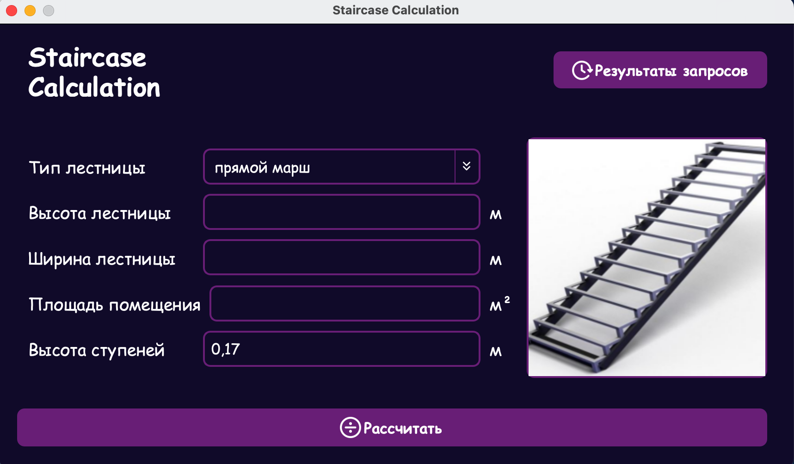
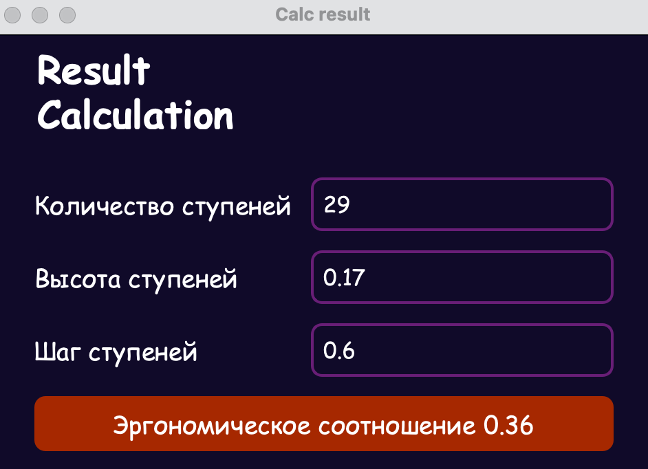

# Staircase Calculation Application

## Описание

Приложение для расчета параметров лестниц различных типов. Программа позволяет рассчитать количество ступеней, их высоту и шаг на основе введенных пользователем данных о лестнице.

## Функциональность

- Расчет параметров для 5 типов лестниц:
  - Прямой марш
  - Два прямых маршей
  - Угловая
  - Винтовая
  - Поворотная

- Расчет основных параметров:
  - Количество ступеней
  - Высота ступеней
  - Шаг ступеней
  - Проверка эргономического соотношения

- Дополнительные возможности:
  - Визуализация типа лестницы
  - Сохранение истории расчетов в базе данных
  - Просмотр всех предыдущих расчетов

## Технические требования

- Python 3.x
- PySide6 6.10.0
- SQLite (встроенная)

## Установка и запуск

### Автоматическая установка (Windows)

1. Запустите файл `StairCase.vbs`
2. Скрипт автоматически создаст виртуальное окружение и установит необходимые зависимости
3. Приложение запустится автоматически

### Ручная установка

1. Убедитесь, что у вас установлен Python 3.x
2. Создайте виртуальное окружение:
   ```bash
   python -m venv venv
3. Установите зависимости:
   ```bash
   pip install -r requirements.txt
4. Запуск:
   ```bash
   python main.py

## Скриншоты


